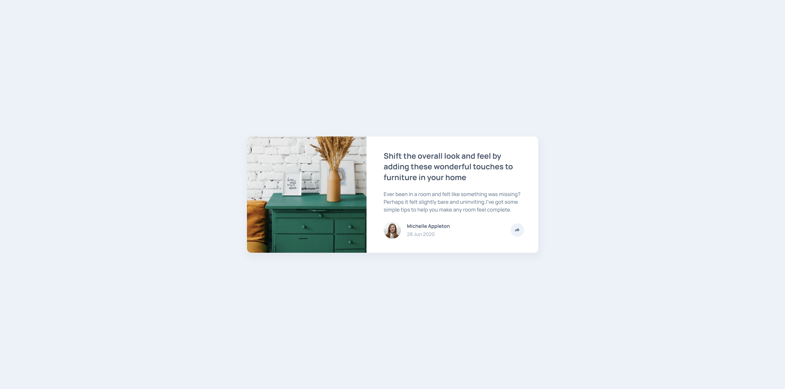

# Frontend Mentor - Article preview component solution

This is a solution to the [Article preview component challenge on Frontend Mentor](https://www.frontendmentor.io/challenges/article-preview-component-dYBN_pYFT). Frontend Mentor challenges help you improve your coding skills by building realistic projects.

## Table of contents

- [Overview](#overview)
  - [The challenge](#the-challenge)
  - [Screenshot](#screenshot)
  - [Links](#links)
- [My process](#my-process)
  - [Built with](#built-with)
  - [What I learned](#what-i-learned)
- [Author](#author)

## Overview

### The challenge

Users should be able to:

- View the optimal layout for the component depending on their device's screen size
- See the social media share links when they click the share icon

### Screenshot



### Links

- Solution URL: [Add solution URL here](https://www.frontendmentor.io/solutions/article-preview-component-ySwkOjsDLk)
- Live Site URL: [Add live site URL here](https://fm-article-preview-component-mk.netlify.app/)

## My process

### Built with

- Semantic HTML5 markup
- CSS custom properties
- JavaScript

### What I learned

This section highlights the major learnings I gained from this project. Documenting these insights, along with code samples, helps reinforce my understanding and serves as a reference for future projects.

```html
<article
  class="card"
  aria-label="Shift the overall look and feel by adding these wonderful touches to furniture in your home">
  <figure class="card-image">
    
  </figure>
  <section class="card-body">
    <header class="card-body-heading">
      <h1>Shift the overall look and feel by adding these wonderful touches to furniture in your home</h1>
    </header>
    <div class="card-body-text">
      <p>
        Ever been in a room and felt like something was missing? Perhaps it felt slightly bare and uninviting. I've got
        some simple tips to help you make any room feel complete.
      </p>
    </div>
    <footer class="card-body-footer">
      <div class="profile-card">
        <figure class="profile-image">
          
        </figure>
        <figcaption class="profile-info">
          <h2>Michelle Appleton</h2>
          <time datetime="2020-06-28">28 Jun 2020</time>
        </figcaption>
      </div>
      <div id="profile-share" class="profile-share">
        <button
          type="button"
          onclick="toggleShareMenu()"
          id="share-button"
          class="btn btn-share"
          aria-label="Share this article">
          ${getSVGForShareOption("share")}
        </button>
      </div>
    </footer>
  </section>
</article>
```

```js
function closeShareMenuOnClickOutside(event) {
  const target = event.target;
  const shareMenu = document.getElementById("share-menu");
  const isClickOutsideShareMenu =
    !shareMenu.contains(target) && target.id !== "share-button" && !target.closest("#share-button svg");
  if (isClickOutsideShareMenu) toggleShareMenu();
}
```

## Author

- Website - [www.mario-kreitz.dev](https://www.mario-kreitz.dev)
- Frontend Mentor - [@mariokreitz](https://www.frontendmentor.io/profile/mariokreitz)
- LinkedIN - [Mario Kreitz](https://www.linkedin.com/in/mario-kreitz-70b68b336/)
